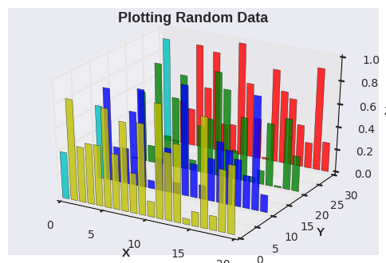

aes807

Hi Achilles, your plots are extremely easy to understand. Great visuals! For the first one, 'Plotting of the Total Time-Zones
in America for Randomized Data', the font sizes, color scheme, axis labels, and title give the viewier a great summary of 
what you're plotting. While the legend is nice, I don't think it's necessary because you are only plotting the one graph.
I like the background grid you decided to include as well because I can easily quantify the time zone counts. My only real
piece of feedback here is that I am not quite sure what it is you are counting. I know the assignment was to plot anything 
you want, so this count is fine, however the one piece of improvement would be to plot a count of something that is more
understandable.

The randomly generated 3D plot is also easy to read. Given its dimensionality, it might be nice to have fewer bar plots though.
It is a little complex.  
