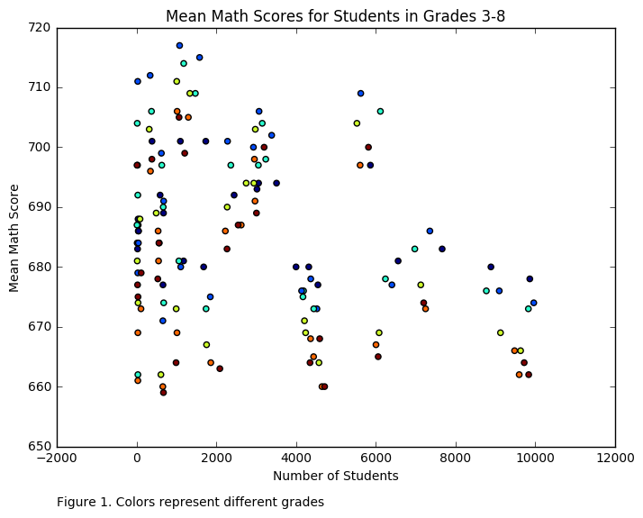

as10790

Hi Anastasia, great plot! I think that differentiating the grades by colors is an incredibly useful visual aid. The title, and axis labels also provide a succinct summary of what you are visualizing. 

A couple of thoughts:
I think adding a legend would be helpful so that it is clear which color is associated with which grade. 
Also, since the title of the plot is 'Mean Math Scores for Students Grades 3-8', I assumed that I would see one scatter point per grade corresponding to the grade's average. Instead though, there are many scatter points per grade, so it's a little confusing. Given the dataframe, it looks like the different points per grade are associated with the mean math scores by race, so incorporating that variable in the legend or x axis label would make the plot a little more clear. 

On a side note: I'm not sure how it would all fit in one graph, but it might be interesting to show the change of mean math scores by race over time. One example of this would be to create five different graphs, one per year, and plot the mean math scores by race for one year at a time and then compare them. A histogram may also be an interesting way to depict the distribution of different scores. 

Overall, I think the plot honestly reproduces the data, and I think the color by grade is absolutely great! I would just add the element of race somewhere. Nice job!
